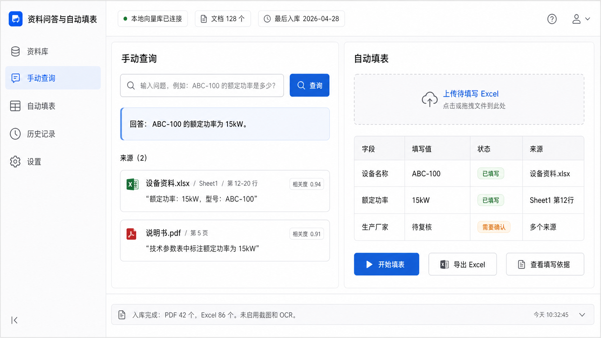

# quality-system

## 资料问答与自动填表工具

这是一个面向个人使用的轻量级本地知识库工具方案。目标是把本地资料文件解析入库，支持手动提问、来源引用，以及从资料库中自动提取文字填写 Excel 表格。

## 当前 MVP 目标

- 支持本地资料入库：PDF、Excel、Word、TXT、Markdown。
- 支持手动查询：返回答案、原文摘录、来源文件、页码或 Sheet/行号。
- 支持文字自动填表：读取待填写 Excel 的字段，自动检索资料库并填写文字值。
- 支持填写依据追踪：为每个自动填写结果生成来源文件、原文摘录和状态。
- 暂不做截图、图片识别、OCR、Excel 图片填表、复杂 Agent 插件。

## 推荐技术栈

- Python
- Streamlit
- ChromaDB
- PyMuPDF
- openpyxl
- python-docx
- OpenAI-compatible LLM API

## 建议目录结构

```text
project/
  docs/                 # 放资料文件
  db/                   # Chroma 向量库
  exports/              # 导出填好的表格
  assets/               # UI 预览图
  app.py                # Streamlit 页面
  ingest.py             # 文档入库
  rag.py                # 检索问答
  fill_form.py          # 自动填表
  requirements.txt
```

## UI 预览



## 实现路径

1. 文档入库
   - 扫描 `docs/` 文件夹。
   - 提取 PDF、Excel、Word、TXT/Markdown 文本。
   - 按段落或固定长度切分 chunk。
   - 将文本和 metadata 写入 ChromaDB。

2. 手动查询
   - 用户输入问题。
   - 向量库检索最相关 chunk。
   - LLM 基于检索结果生成回答。
   - 页面展示答案、原文摘录和来源位置。

3. 自动填表
   - 上传待填写 Excel。
   - 默认识别第一列为字段名，第二列为待填写值。
   - 对每个字段生成查询问题。
   - 检索资料库并抽取填写值。
   - 写回 Excel。
   - 新增 `填写依据` Sheet，记录来源和状态。

4. 人工复核
   - 每个结果标记为 `已填写`、`需要确认` 或 `未找到`。
   - 用户通过来源文件、页码、Sheet、行号和原文摘录复核。

## 难度评估

这个个人版项目整体难度为中等偏低。去掉截图、OCR、OpenClaw 插件和图片填表后，核心功能可以在 1-2 天内完成可用原型。

最容易踩坑的部分是 Excel 解析和自动填表字段匹配。第一版建议采用固定模板规则，避免让系统自由猜复杂表格结构。
